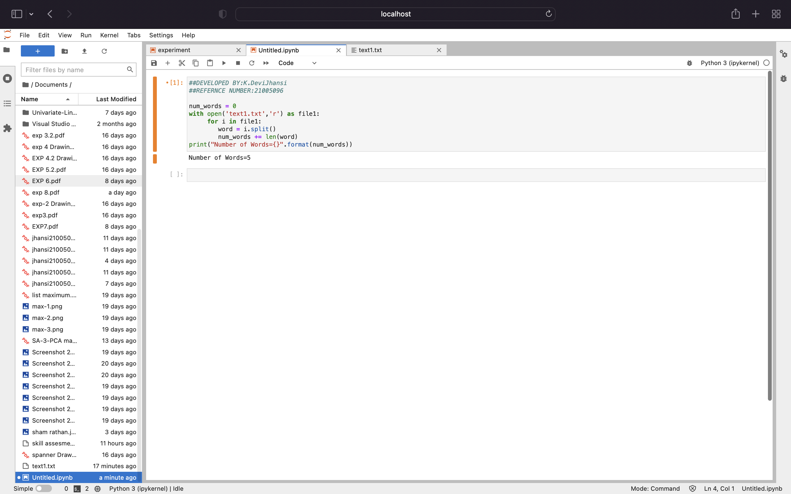

# Word-count
## AIM:
To write a python program for getting the word count from a text.
## EQUIPEMENT'S REQUIRED: 
PC
Anaconda - Python 3.7
## ALGORITHM: 
### Step 1:
Open flie in read mode.
### Step 2: 
 Read the text using read funcion.
### Step 3: 
Split the text using space separator.
### Step 4:  
The length of the split list should be equal to the number of words in the text file.
### Step 5: 
Now give print().
### Step 6: 
End the program.
## PROGRAM:
~~~
##DEVELOPED BY:K.DeviJhansi
##REFERNCE NUMBER:21005096

num_words = 0
with open('text1.txt','r') as file1:
     for i in file1:
        word = i.split()
        num_words += len(word)
print("Number of Words={}".format(num_words))
~~~
### OUTPUT:

## RESULT:
Thus the program is written to find the word count from a text.
